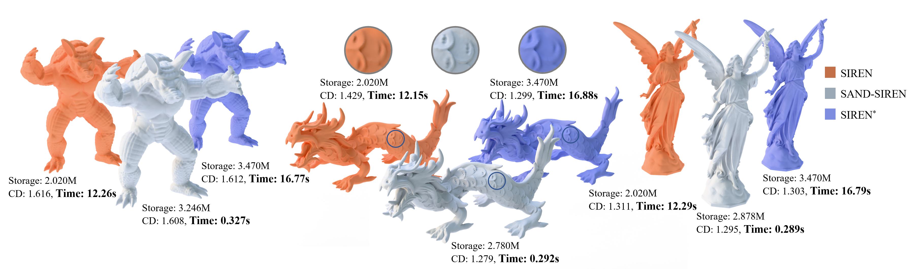

<p align="center">
  <h1 align="center">SAND: Spatially Adaptive Network Depth for Fast Sampling of Neural Implicit Surfaces</h1>
  <h2 align="center">ACM Transactions on Graphics (TOG) / SIGGRAPH 2026</h2>

  <p align="center">
    <a href="https://arxiv.org/pdf/2604.25936"><strong>Paper</strong></a> |
    <a href="https://chuanxiang-yang.github.io/SAND/"><strong>Project Page</strong></a> |
    <a href="https://arxiv.org/abs/2604.25936"><strong>arXiv</strong></a>
  </p>
</p>

<p align="center">
  
</p>

---

## Overview

Neural implicit representations have demonstrated remarkable capability in modeling complex 3D geometry. However, existing approaches typically employ a fixed-depth multilayer perceptron (MLP), requiring every spatial query to traverse the entire network regardless of local geometric complexity, resulting in unnecessary computation.

In this paper, we propose **Spatially Adaptive Network Depth (SAND)**, an efficient neural implicit geometry representation framework that adaptively adjusts network evaluation depth according to spatial complexity.

SAND consists of two key components:

- **Volumetric Network-Depth Map**, which records the minimum network depth required for each spatial region to achieve sufficient reconstruction accuracy.
- **Tailed Multi-Layer Perceptron (T-MLP)**, a modified MLP architecture where an output branch ("tail") is attached to every hidden layer, enabling adaptive early termination during inference.

By allocating computational resources only where necessary, SAND significantly accelerates inference while preserving high-fidelity geometric reconstruction.

Extensive experiments demonstrate that SAND substantially improves the inference-time query efficiency of neural implicit representations while maintaining high reconstruction fidelity.

---

## Requirements

The code has been tested with:

- Python 3.8
- PyTorch 2.0.1
- CUDA 11.7

---

## Installation

Create a conda environment:

```bash
conda create -n SAND python=3.8
conda activate SAND
```

Install the required Python packages:

```bash
pip install -r requirements.txt
```

Install PyTorch:

```bash
conda install pytorch==2.0.1 torchvision==0.15.2 torchaudio==2.0.2 pytorch-cuda=11.7 -c pytorch -c nvidia
```

---

## Running

To reproduce the reconstruction experiments:

```bash
cd experiments
bash scripts/run_recon.sh
```

To reconstruct other datasets or scenes, please refer to `scripts/run_3dscene_recon.sh` and modify the script accordingly.

---

## Acknowledgements

This project builds upon the excellent [BACON](https://github.com/computational-imaging/bacon) codebase. We sincerely thank the authors for making their implementation publicly available.

---

## Citation

If you find our work useful in your research, please consider citing:

```bibtex
@article{yang2026sand,
  title={SAND: Spatially Adaptive Network Depth for Fast Sampling of Neural Implicit Surfaces},
  author={Yang, Chuanxiang and Hou, Junhui and Liu, Yuan and Ren, Siyu and Wei, Guangshun and Komura, Taku and Zhou, Yuanfeng and Wang, Wenping},
  journal={ACM Transactions on Graphics (TOG)},
  volume={45},
  number={4},
  pages={1--14},
  year={2026},
  publisher={ACM New York, NY, USA}
}
```

---

## License

This project is released under the MIT License. See the `LICENSE` file for details.
